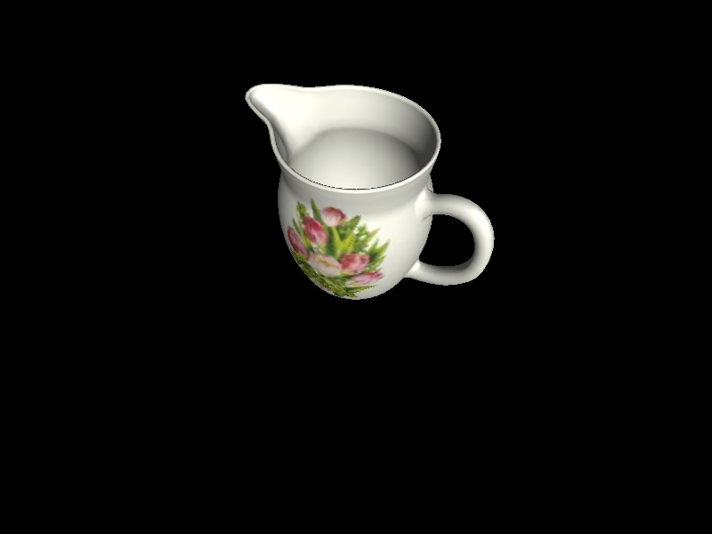
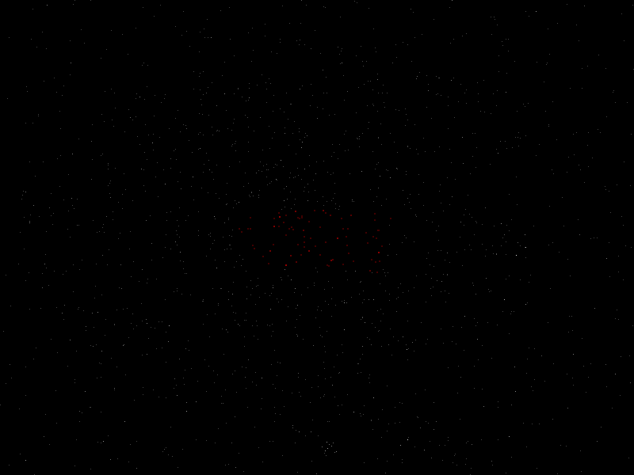
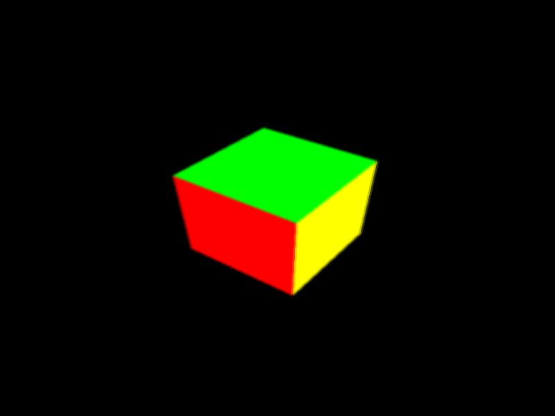
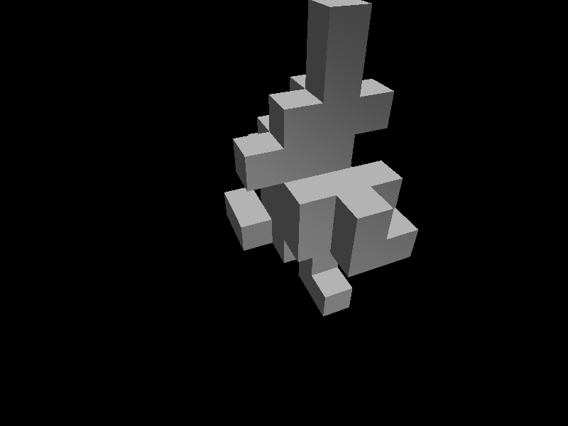

MiGL : Rust mid-level abstraction over OpenGL
==================================================

MiGL offers a low-level abstraction over OpenGL primitives. Important objects like buffers, textures, programs, shaders are wrapped in a saf*er* Rust-looking API.

## Usage


### Create buffer

```rust
let buffer_vertices : Buffer<V3> = // Buffer data is typed
	BufferBld::array()             // also .uniform() to create a uniform buffer 
	.dynamic()                     // defines how often we'll need to pass data, also .r#static() 
	.data(&VERTICES)               // pass any data 
	.expect("Couldn't create buffer");            
```

### Create shader

The shaders' types encode whether they are vertex, fragment or geometry.

```rust
let vertex_shader = Shader::<Vertex>::from_file("resources/shaders/cube/vert.glsl").unwrap();
let fragment_shader = Shader::<Fragment>::from_string(fragment_shader_str).unwrap();
```

### Create program


```rust
let program =
	ProgramBuilder::new(
		Shader::<Vertex>::from_file("resources/shaders/cube/vert.glsl").unwrap(), 
		Shader::from_file("resources/shaders/cube/frag.glsl").unwrap(), // type-checker can in fact infer which shader you meant
	)
	.geometry(geom_shader) // optionally a geometry shader
	.build()
	.unwrap();
```

### Bind buffer & pass uniforms

```rust
// buffer_vertices : Buffer<V3>
// if the "position" data is simply laid out back to back in the buffer
program.bind("position", buffer_vertices.direct_view()).unwrap();


#[repr(C)]
struct Vertex {
	position : V3,
	color    : V3
}


// buffer_vertices : Buffer<Vertex>
// if the "position" data is a "position" field in the "Vertex" structure
program.bind("position", buffer_vertices.view(field!(position))).unwrap();
```


## Example uses

These examples can be run with

```bash
cargo r --all-features --example NAME_EXAMPLE
```

### jug

**Demonstrates:** *texturing, shading*

A low-quality textured jug, with diffuse and specular shading. Rotate around & zoom with directional arrows, adjust height of camera with Z/S.




### planetarium

**Demonstrates:** *atypical shaders*

Current constellation is in red. Pan with middle mouse drag. Navigate to previous/next constellation with P/N.




### capture

**Demonstrates:** *framebuffer manipulations*

A simple cube. Press B to blur and I to save a screenshot.



### dynamic_blob

**Demonstrates:** *dynamic buffers and passing data to GPU*

A blob made out of cube. Press I to add a cube to the blob.

